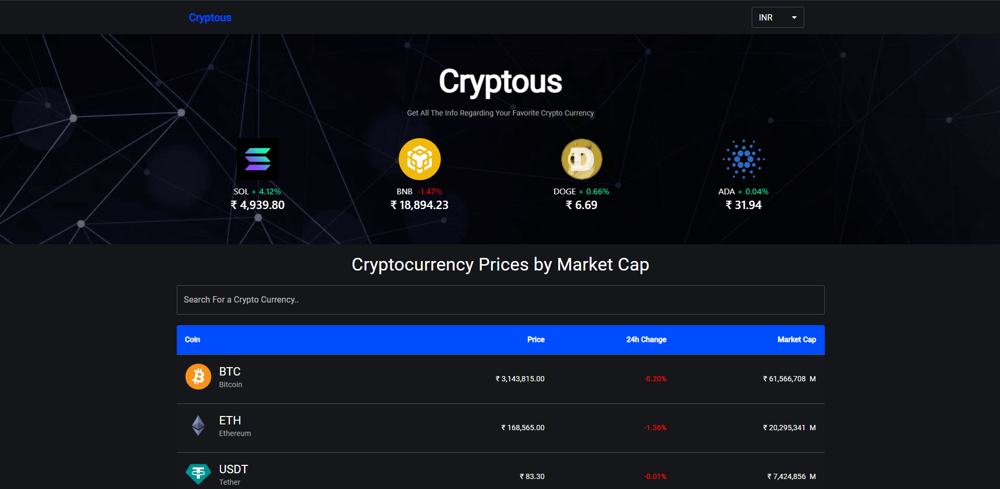
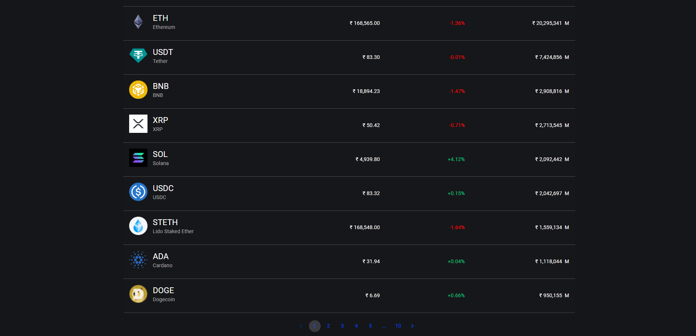
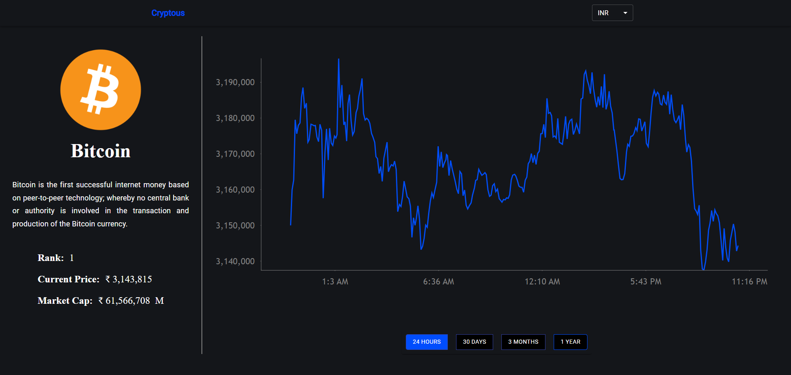
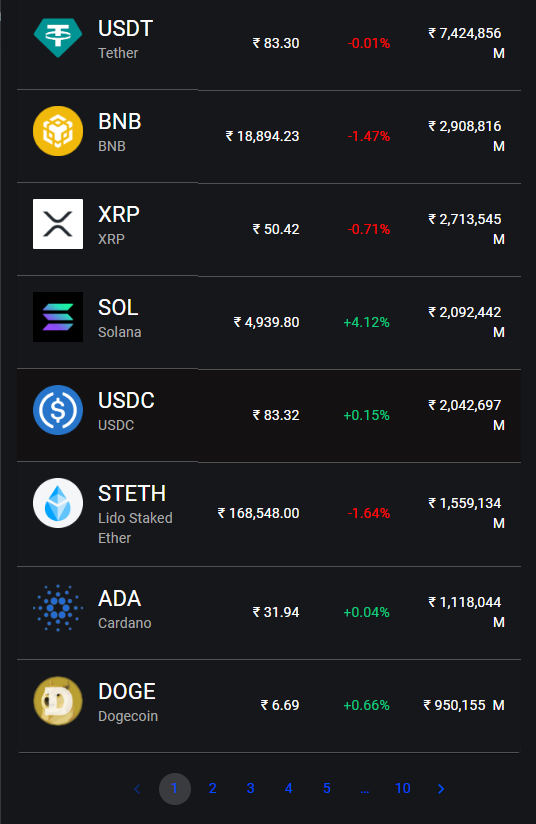
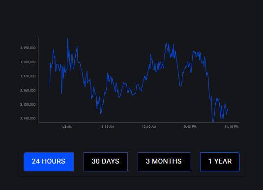

# Cryptous- A Crypto Tracker Website

Cryptous is a fully responsive Crypto Tracker website, with maximum compatiblities in all mobile devices, built using React Js.

## Images

Desktop view




Mobile view   





## Prerequisites

Before you begin, ensure you have met the following requirements:

* [Git](https://git-scm.com/downloads "Download Git") must be installed on your operating system.

## Installing Cryptous

To install **Cryptous**, follow these steps:

Linux and macOS:

```bash
sudo git clone https://github.com/khanimran17/crypto-tracker-app.git
```

Windows:

```bash
git clone https://github.com/khanimran17/crypto-tracker-app.git
```